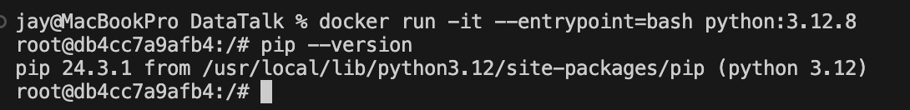

### Homework 1: 01-NYC-Taxi-Data-Ingestion-Postgres-Docker

This README contains my solutions and approach to completing the tasks for Module 1, which focuses on **Docker, SQL, and Terraform**. Below, you’ll find an overview of the tasks, solutions, and key steps I followed.

---

## 📋 Tasks and Solutions  

### **Question 1: Understanding Docker First Run**  
Run the `python:3.12.8` image interactively with the entrypoint set to `bash`. Determine the version of `pip` in the image.  

**Answer:**  

- Pip Version: `24.3.1`


---

### **Question 2: Docker Networking and docker-compose**  
Using the provided `docker-compose.yaml`, identify the hostname and port for **pgAdmin** to connect to the PostgreSQL database.  

**Answers:**  
- Hostname: `postgres`  - Port: `5432`  
- Hostname: `db`  - Port: `5432`  

---

### **Prepare Postgres**  
I set up a PostgreSQL instance and loaded the required datasets using the steps provided in the course.  

1. Downloaded the datasets:  
   ```bash
   wget https://github.com/DataTalksClub/nyc-tlc-data/releases/download/green/green_tripdata_2019-10.csv.gz
   wget https://github.com/DataTalksClub/nyc-tlc-data/releases/download/misc/taxi_zone_lookup.csv
   ```
2. Loaded the data into PostgreSQL using a Python script `pipe.py` for automation.  

---

### **Question 3: Trip Segmentation Count**  
Count trips by distance segmentation for October 2019:  
1. Up to 1 mile  
2. 1-3 miles  
3. 3-7 miles  
4. 7-10 miles  
5. Over 10 miles  

**Answer: [question3.sql](./question3.sql)**  
`104,802; 198,924; 109,603; 27,678; 35,189`

---

### **Question 4: Longest Trip for Each Day**  
Find the pickup day with the longest trip distance (use pickup time for calculations).  

**Answer: [question4.sql](./question4.sql)**  
- Longest trip occurred on: `2019-10-31`

---

### **Question 5: Three Biggest Pickup Zones**  
Identify the top 3 pickup locations with total amounts exceeding 13,000 on `2019-10-18`.  

**Answer: [question5.sql](./question5.sql)**  
- Top pickup zones: `East Harlem North, East Harlem South, Morningside Heights`

---

### **Question 6: Largest Tip**  
For passengers picked up in **East Harlem North**, determine the drop-off zone with the largest tip.  

**Answer: [question6.sql](./question6.sql)**  
- Drop-off zone with the largest tip: `JFK Airport`

---

### **Terraform Tasks**  

I used Terraform to set up infrastructure on Google Cloud Platform (GCP):  

1. Installed Terraform on my environment.  
2. Cloned and customized the course files from the [Terraform section](#).  
3. Created a GCP Bucket and a BigQuery dataset as required.  

---

### **Question 7: Terraform Workflow**  
Select the correct sequence for the Terraform workflow:  
1. Download provider plugins and set up the backend.  
2. Generate proposed changes and auto-execute the plan.  
3. Remove all resources managed by Terraform.  

**Answer:**  
`terraform init, terraform apply -auto-approve, terraform destroy`

---

## 🛠 Tools Used  

- **Docker** for containerization.  
- **PostgreSQL** for database setup and data analysis.  
- **Terraform** for infrastructure as code.  

---

## 📩 Questions or Feedback?  

Feel free to reach out or open an issue in this repository if you have questions, suggestions, or feedback!  

---  
